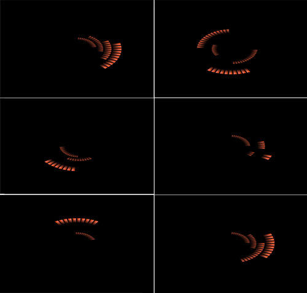

# DrawErrorPlugin

This project provides summary visual feedback for a clinic-based interactive stroke rehabilitation system developed with a team of other students and faculty as part of my graduate work at Arizona State University (ASU)

Currently this project functions as a plugin for MacOS software developed by Loren Olson at ASU, which is not yet publicly available

This project therefore will not run as a standalone project yet until future updates are made

This project is being transported from another private repo, requires some cleaning, and links to supporting SDKs. (To be updated)

Overview:

This project functions as part of a larger interactive system that provides audiovisual feedback based on the upper extremity and torso movement performance of a stroke survivor performing a series of functional tasks. This project receives data analysis results from other plugins (not included here) and displays the appropriate feedback.

Trajectory error is visualized following a single reach as red marks that appear to recede into space

